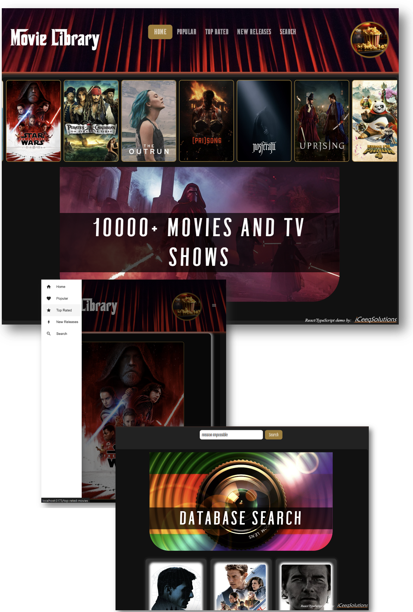

# Movie Library - a React/TypeScript Demo

  TypeScript Demo by <a href="https://iceeqsolutions.fi/">iCeeqSolutions</a>

## About

The Movie Library is a React/TypeScript demo project demonstrating the use of interfaces, styled modules, Material UI, page routing and the use of an API.

The navbar contain different sections to choose from - the home page, the popular movies page, the top rated movies page, new releases and a search page.

The user is able to click on either the images in the scroll bar or on the movie cards in order to view more details about the move. In addition, it is also possible to search the database for a specific movie.

The API does contain both movies and tv shows, but to facilitate things in this project, only movies are readily available. However, the project does contain the urls to each endpoint and commented out code that can be tested in order to view tv shows as well.

## Demo

👁️ [Live Demo](https://)

## Built with

- Vite
- TypeScript
- React
- Styled components
- Material UI
- API data
- Prettier

## Features

- Search functionality
- Styled module
- React components
- TS interfaces
- Routing
- Environment variables

  

  
